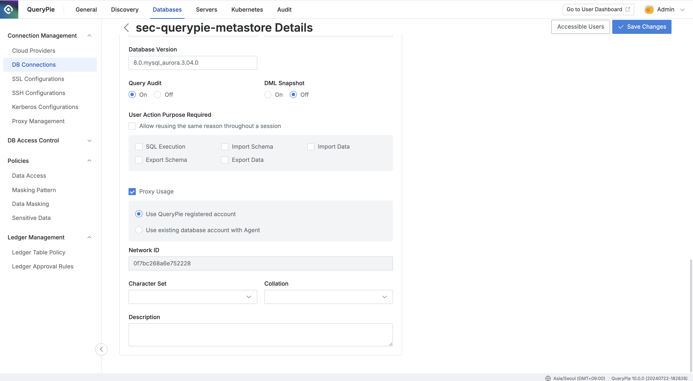
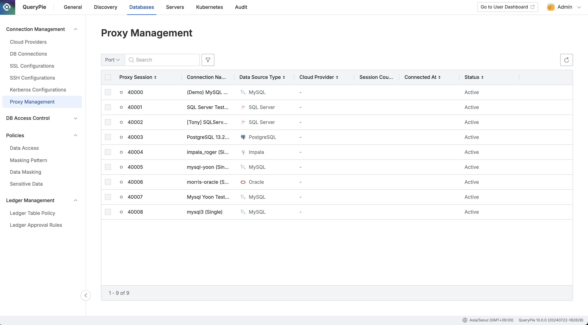

# Database Proxy 사용 활성화

## Overview

데이터베이스 커넥션 접속시 Proxy 연결을 지원합니다. 기본적으로 QueryPie 에서 제공하는 웹 SQL 에디터를 통해 커넥션에 접속할 수 있고, QueryPie 에서 생성한 Proxy Credential 정보 또는 Agent 를 통한 기존의 DB username/password로 쓰시던 툴에서 커넥션에 접속할 수 있습니다. 웹 SQL 에디터와 함께 Proxy 연결을 지원하여 다양한 사용자 환경에서도 문제없이 커넥션 접근을 제어하고, 정책을 적용할 수 있으며, 로그를 남길 수 있습니다. 현재 Proxy 연결은 MySQL, MariaDB, Oracle, PostgreSQL, Redshift, Trino, SQLServer, MongoDB 를 지원합니다.

## Proxy 사용 옵션 활성화

기본적으로는 Proxy 사용 옵션이 비활성화되어 있습니다. 접속을 허용할 커넥션에서 Proxy 사용 여부를 활성화합니다.

Administrator > Databases > Connection Management > DB Connections > Connection Details > Proxy Usage

1. Database 설정 메뉴에서 DB Connections 메뉴로 이동합니다.

2. 등록한 커넥션을 하나 클릭합니다.

3. 하단의 Additional Information 항목으로 이동합니다.

4. `Proxy Usage` 옵션을 체크하여 활성화합니다.

5. 두 가지 Proxy 인증 방식 중 하나를 선택합니다.

   1. **Use QueryPie registered account**: 관리자가 커넥션 정보 페이지 내에 저장한 DB username / password 기준으로 Proxy 접속 정보를 생성하는 방식입니다. 사용자는 Agent 또는 별도로 생성된 Proxy Credential 정보를 이용해 Proxy 로 접속할 수 있습니다.

   2. **Use existing database account with Agent** : 사용자가 기존에 사용하던 DB username / password 를 사용할 수 있는 방식으로 Proxy 접속 정보가 생성됩니다. 사용자는 Agent 에서 실행 후 localhost 와 port 정보를 이용해 Proxy 로 접속할 수 있습니다.

※ 사용자의 DB username / password 인증을 사용할 경우, Agent 를 통해서만 접속 가능합니다.

6. **Network ID** : Reverse SSH 기능을 사용하는 경우에 필요한 설정 값입니다.

Proxy Usage 옵션을 활성화하면 Proxy 로 접속할 수 있는 Port 가 해당 커넥션에 할당됩니다. 사용자는 해당 옵션이 활성화되면 Proxy 접속 정보를 확인할 수 있고, 관리자만 해당 Proxy 옵션을 설정할 수 있습니다.

## Proxy 사용 활성화된 커넥션 확인하기

10.3.0 부터 Databases > Connection Management > Proxy Management 는 Databases > Monitoring > Proxy Management 로 이동되었습니다. 10.3.0 이후 버전 사용자는 링크의 [문서](https://querypie.atlassian.net/wiki/x/LgPgO)를 참고하시기 바랍니다.

Administrator > Databases > Connection Management > DB Connections > Proxy Management

1. Database 설정 메뉴에서 Proxy Manangement 메뉴로 이동합니다.

2. 클러스터 기준으로 Proxy 사용이 활성화된 커넥션과 Port 정보를 확인할 수 있습니다.

3. Proxy 접속을 통해 커넥션에 연결 중인 사용자를 확인할 수 있고, 필요한 경우 해당 세션을 `Kill`할 수 있습니다.