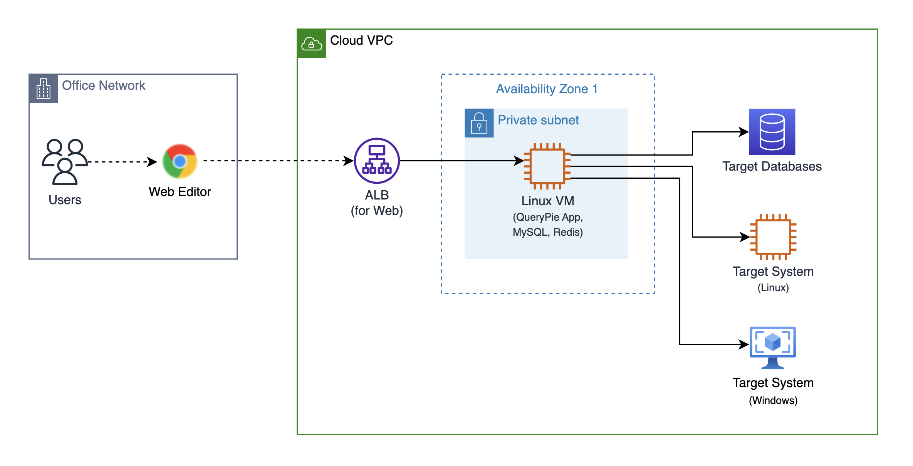
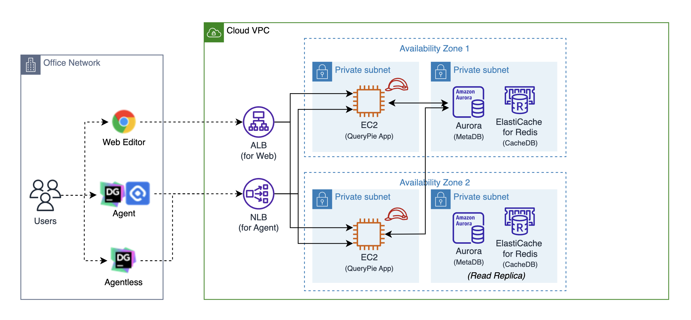

# 시스템 구성도 개요

## Overview

QueryPie는 클라우드 및 온프레미스 환경에서 작동하는 웹 애플리케이션 아키텍처를 갖고 있습니다.

QueryPie는 Linux VM 상에서 도커 컨테이너 형태로 작동하는 것이 일반적이며, TLS 인증서로 보호된 웹 애플리케이션으로 운영하는 것이 권장됩니다. 고객이 클라우드 환경에 QueryPie를 설치하고 운영하는 경우, 로드 밸런서 및 TLS 인증서를 적용하여 구성하는 것이 권장됩니다. 연결 설정 및 사용자 정보와 같은 QueryPie 운영에 필요한 리소스는 MySQL 데이터베이스에 저장됩니다. 빠른 응답 시간을 위해 Redis를 임시 저장소로 활용합니다.

QueryPie의 바이너리 패키지는 도커 이미지로 만들어져 있으며, OS 및 도커 데몬이 최근 버전인 경우 Azure, AWS, GCP의 Linux VM 또는 물리적인 Linux 서버에 배포할 수 있도록 준비되어 있습니다. 또한 네이티브로 Kubernetes를 지원하지만, 주로 Kubernetes DevOps 팀이 있는 고객을 대상으로 권장됩니다. 시험평가용 바이너리 패키지는 고객에게 제공되는 버전과 동일합니다. 제품의 기능은 공급사가 원격으로 제공하고 설치하는 설치된 라이선스에 의해 관리됩니다. 평가 라이선스는 일반적으로 2주~4주의 사용 기간을 제공합니다.

## 시험평가를 위한 간단한 구성

Simple System Configuration for Evaluation

위의 시스템 구조는 QueryPie 제품을 시험평가하기 위해 구성하는 간단한 구성의 사례입니다. 이용자는 웹브라우저로 QueryPie에 접속하게 되며, QueryPie는 Application Load Balancer에 연결된 하나의 Linux VM에 설치되어 작동합니다. Linux VM 안에는 QueryPie 애플리케이션이 docker container 방식으로 구동되고, 이 외에 QueryPie가 사용하는 MySQL database, Redis 캐시가 docker container 방식으로 구동됩니다.

QueryPie는 https://querypie-poc.customer.com/과 같은 TLS 인증서가 적용된 웹서비스 URL 을 갖게 되며, 이를 구성하기 위해 TLS 인증서와 함께 Application Load Balancer 를 설정하는 것을 권장합니다.

## 시험 평가 구성을 위한 사전 준비사항

테스트 및 평가 목적으로 QueryPie를 설치하기 위해 필요한 준비 사항은 다음과 같습니다.

1. 제품에 접속하기 위한 Fully Qualified Domain Name (FQDN)

   - 원하는 도메인을 자유롭게 선택할 수 있습니다. 예) querypie-poc.customer.com

2. 위 FQDN를 위한 로드 밸런서(LB)와 TLS 인증서

   - QueryPie 기술 지원 담당자가 TLS 인증서 파일에 직접 액세스할 필요는 없습니다.
   
   - 그러나 QueryPie는 TLS가 적용된 로드 밸런서(LB)가 필요합니다.
   
   - AWS의 경우, [Application Load Balancer](https://docs.aws.amazon.com/elasticloadbalancing/latest/application/introduction.html) 가 이에 해당합니다.
   
   - Azure의 경우, [Application Gateway](https://learn.microsoft.com/en-us/azure/application-gateway/overview) 가 이에 해당합니다.
   
   - GCP의 경우, [Application Load Balancer](https://cloud.google.com/load-balancing/docs/application-load-balancer) 가 이에 해당합니다.

3. QueryPie를 실행할 Linux VM

   - 평가 목적으로는 2개의 vCPU와 8GiB 메모리를 사용하는 것이 권장됩니다.
   
   - 로드 밸런서를 적용하는 것이 필수적이지만, 2개 이상의 VM 인스턴스를 구성할 필요는 없습니다.
   
   - QueryPie를 단일 VM에 설치하더라도 제품의 기능을 효과적으로 테스트할 수 있습니다.

4. 고객사의 Linux VM 환경에 대한 원격 접근을 임시로 허용해 주세요.

   - 로드 밸런서 및 TLS 설정을 위한 임시 Azure, AWS, GCP 계정을 제공할 수 있습니다. SSH 공개 키를 통해 액세스할 수 있는 Linux VM 인스턴스의 구성하고, SSH 공개 키(.pem 파일)를 제공할 수 있습니다.

## 실사용을 위한 시스템 구성의 요약

Summary of System Architecture for Real Use

위 구성은 상세 시스템 아키텍처가 아닌 이용자의 이해를 돕기 위해 요약된 구성도입니다.

위의 구성은 실제 QueryPie 제품을 사용하는 경우에 적용되는 시스템 구성의 주요 요소를 요약하여 표현한 사례입니다. 이용자가 웹브라우저로 QueryPie에 연결하여 사용할 수 있습니다. 그뿐만 아니라, DataGrip, MySQL Workbench, iTerm, Putty 등 이용자 PC에서 실행하는 애플리케이션에서 DB, System에 접속하기 위해, QueryPie Agent를 PC에 설치하여 사용할 수 있습니다.

클라우드 환경에 구성된 QueryPie 서버는 웹 애플리케이션으로 작동하기 위해 이중화된 구성을 갖고 있으며, 클라우드에서 제공하는 Managed Service 방식의 MySQL, Redis를 사용하는 것을 권장합니다. PC에 설치된 QueryPie Agent는 TCP 기반의 자체 프로토콜을 이용해 QueryPie 서버에 연결하며, 이를 위해 Network Load Balancer를 구성하는 것을 권장합니다.